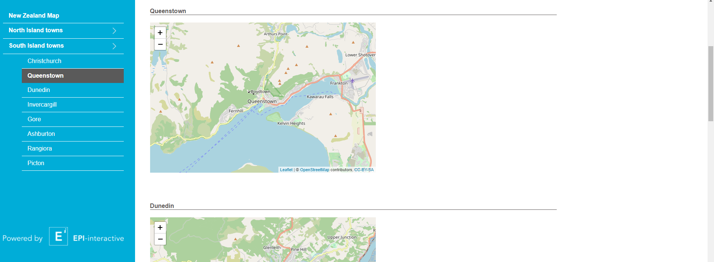

# Scrolling Tabs
This builds a vertical tab bar which can be used to smoothly navigate to the chosen elements by clicking on the appropriate tab. When dealing with long web pages, scrolling tabs are more convenient to use. The user chooses which title to explore from a tab selection rather than scrolling to the title. This can be done using "scroll-to-element" function implemented in JavaScript.


You can try out the app <a href="https://rshiny.epi-interactive.com/apps/scrolling-tabs" target="_blank" rel="noopener noreferrer">here</a>


<kbd></kbd>


# How it works
1. A vertical tab input is created in the ui.R, which contains a list of names of all tabs.
 ``` r
 verticalTabsInput("tabs",
          list(
             "New Zealand Map",
             "North Island towns" = list(
                 "Wellington",
                 "Auckland",
                 "Tauranga",
                 "Hamilton",
                 "Napier",
                 "Palmerston North",
                 "Gisborne",
                 "Rotorua"
             ),
             "South Island towns" = list(
                 "Christchurch",
                 "Queenstown",
                 "Dunedin",
                 "Invercargill",
                 "Gore",
                 "Ashburton",
                 "Rangiora",
                 "picton"
                 )
                )
                                            
             )
 ```
2. This R function handles which tab is active and the click event. It also handles the differences between the type of tab selected. For instance, it checks if the tab selected was a drop-down or selection tab.
``` r
      G_NZ_towns <- list(
        "North Island towns" = "North_island_towns",
        "South Island towns" = "South_island_towns"
      )
      
      item_id <- G_NZ_towns[names(G_NZ_towns) == elemName]
      
      items[[num]] <- div(class = "vt-dropdown", 
                          div(id = item_id, class=paste("vertical-tab", if(elemName==active){"active"}),
                              onclick = paste0("toggleVerticalTabDropdown('", item_id, "', true);"),
                              elemName
                          ),
          div(class = "vt-dropdown-content",
              style = "display: none;",
              subitems
              )
          )
    }
```
3. This JavaScript function hides all other drop-downs when one tab is selected and shows the selected tab.

``` r
const toggleVerticalTabDropdown = function(id, isDropdown) {
    Shiny.setInputValue('activeSection', id);
    // Hide all other drop-downs and show the clicked drop-down
    
    elems = $('.vertical-tab-binding').children('.vt-dropdown');
    elems.children('.vt-dropdown-content').hide();
    if(isDropdown) {
        searchstring = "#" + id + ' + .vt-dropdown-content'
        elems.find(searchstring).show();
    }
    
    scrollToTop();
}
``` 

4. The observe Event reactive function is used to handle the events on the side bar and is added to the server.R. If the tab is clicked, a value based on the name of the tab that was clicked, i.e the section number, is stored in a variable.
 ``` r
  observeEvent(input$tabs, {
     clicked <- gsub(" |\n", "", input$tabs)
     headings <- c("NewZealandMap", "NorthIslandtowns", "SouthIslandtowns")
    
     if(!is.null(clicked) & clicked != "" & !clicked %in% headings) {
        shinyjs::runjs(paste0("scrollToElement(", clicked, ")"))
     }
  })
 ```
5. The "scroll-to-element" JavaScript function is also called every time a tab is clicked, and the name of the tab is passed as a  parameter.

 ``` r
 const scrollToElement = function(element) {
  if(navigator.sayswho.indexOf("IE") > -1) {
    $("html, body").animate({
        scrollTop: element.offsetTop
    }, 1500);

  } else {
    window.scroll({ 
      top: element.offsetTop,
      left: element.offsetLeft,
      behavior: 'smooth'
    });
  }
};
```
6. Each section is rendered using render UI reactive function in the server.R.
